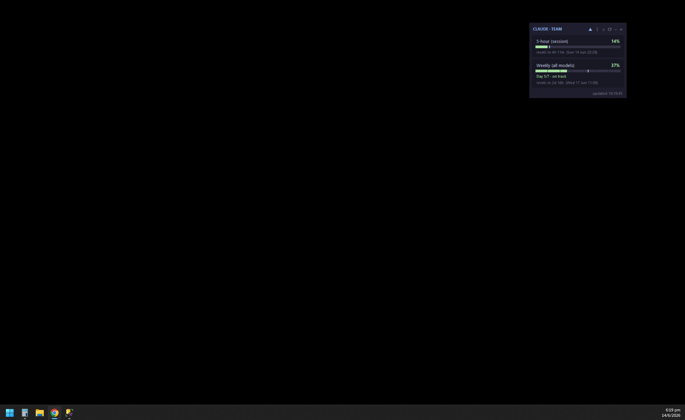
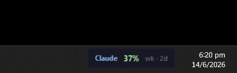

# Claude Quota Widget

A small always-on-top desktop widget showing your live Claude plan usage — the
same numbers as the Claude app / `/usage`. Frameless, drag to move.

## Screenshots

The full widget — 5-hour session and weekly usage with color bars, daily
milestones, pace markers, and reset countdowns.

Collapsed to the mini-bar — a tiny always-on-top strip docked beside the tray.

## More

See [claude_usage_widget_README.md](claude_usage_widget_README.md) for full
documentation — controls, features, config, and auto-start setup.
